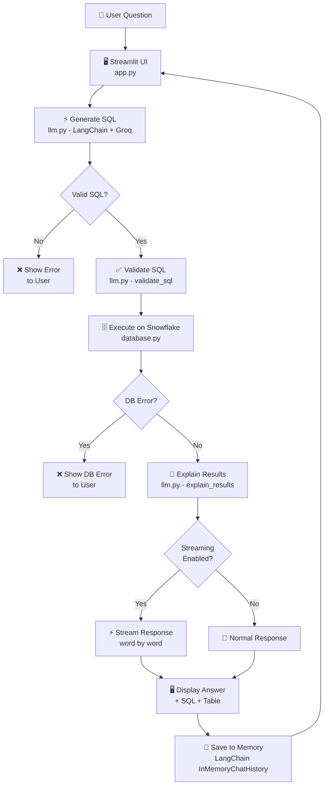
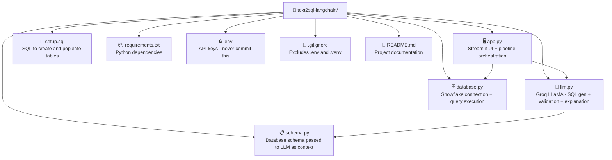

# 🔍 Text-to-SQL AI Assistant

Convert plain English questions into SQL queries and get instant answers
from your Snowflake database — powered by Groq LLaMA 3.3 + LangChain + Snowflake.


## 🌐 Live Demo
👉 Click here to try the app - https://text2sqlwithlangchain-ctegwvayiyj769egn5twz7.streamlit.app/

---

## 📌 What This Project Does

This app lets non-technical users query a Snowflake database using plain
English. No SQL knowledge required.

**Example questions you can ask:**
- *"Who are the top 3 highest paid employees?"*
- *"Which department has the highest total salary budget?"*
- *"List all employees hired after 2021 in London"*
- *"Which employees work on more than one project?"*

The app translates your question into SQL, validates it, runs it on Snowflake,
and returns a clear natural language answer — with optional live streaming.

---

## 🏗️ Project Architecture



---

## 📁 Project Structure



---

## ✨ Features

| Feature | Description |
|---|---|
| 💬 **Conversation Memory** | Ask follow-up questions naturally using LangChain memory |
| ✅ **SQL Validation** | LLM validates SQL before execution to catch errors early |
| ⚡ **Streaming Responses** | See the answer appear word by word in real time |
| 🔄 **Auto Retry** | Automatically retries on rate limit errors |
| 🔀 **LLM Fallback** | Falls back to Mixtral if LLaMA is unavailable |
| 🧠 **Response Caching** | Caches repeated LLM calls to save tokens |
| 📊 **Raw Data View** | See the underlying query results as a table |
| 🔍 **SQL Transparency** | View the generated SQL for every answer |
| 💡 **AI Suggested Questions** | LLM suggests relevant questions based on your schema |
| 📡 **Callback Logging** | Logs token usage for every LLM call |

---

## 🛠️ Tech Stack

| Layer | Technology |
|---|---|
| Frontend | Streamlit |
| LLM | Groq LLaMA 3.3 70B Versatile |
| Fallback LLM | Groq Mixtral 8x7B |
| LLM Framework | LangChain v1 |
| Database | Snowflake |
| Language | Python 3.12 |
| Memory | LangChain InMemoryChatMessageHistory |
| Caching | LangChain InMemoryCache |

---

## 🗄️ Database Schema

The app queries a Snowflake HR database with 4 tables:

| Table | Description |
|---|---|
| `EMPLOYEES` | Employee records — name, salary, department, location |
| `DEPARTMENTS` | Department info — budget, manager, location |
| `PROJECTS` | Projects — status, budget, timeline |
| `EMPLOYEE_PROJECTS` | Junction table — employee-project assignments |

---

## 🚀 Getting Started

### Prerequisites
- Python 3.12+
- Snowflake account
- Groq API key — free at [console.groq.com](https://console.groq.com)

### 1. Clone the repository
```bash
git clone https://github.com/your-username/text2sql-langchain.git
cd text2sql-langchain
```

### 2. Create a virtual environment
```bash
python -m venv .venv
source .venv/bin/activate  # Mac/Linux
.venv\Scripts\activate     # Windows
```

### 3. Install dependencies
```bash
pip install -r requirements.txt
```

### 4. Set up environment variables

Create a `.env` file in the root directory:
```env
GROQ_API_KEY=your_groq_api_key_here
SNOWFLAKE_ACCOUNT=your_account_identifier
SNOWFLAKE_USER=your_username
SNOWFLAKE_PASSWORD=your_password
SNOWFLAKE_DATABASE=your_database
SNOWFLAKE_SCHEMA=your_schema
SNOWFLAKE_WAREHOUSE=your_warehouse
```

### 5. Set up the Snowflake database

Run `setup.sql` in your Snowflake worksheet to create and populate all 4 tables.

### 6. Run the app
```bash
streamlit run app.py
```

Open [http://localhost:8501](http://localhost:8501) in your browser.

---

## ☁️ Deploying to Streamlit Cloud

1. Push your code to GitHub
2. Go to [share.streamlit.io](https://share.streamlit.io)
3. Connect your GitHub repo
4. Add your secrets under **Settings → Secrets**:

```toml
GROQ_API_KEY = "your_groq_api_key"
SNOWFLAKE_ACCOUNT = "your_account"
SNOWFLAKE_USER = "your_username"
SNOWFLAKE_PASSWORD = "your_password"
SNOWFLAKE_DATABASE = "your_database"
SNOWFLAKE_SCHEMA = "your_schema"
SNOWFLAKE_WAREHOUSE = "your_warehouse"
```

---

## 🔒 Security Notes

- Never commit your `.env` file — it is listed in `.gitignore`
- When deploying to Streamlit Cloud, use the Secrets Manager
- Snowflake credentials are never exposed in the UI or logs

---

## 📸 Screenshots


## 👩‍💻 Author

**Keerthi Vinukonda**
- LinkedIn: https://www.linkedin.com/in/keerthi-v-4022a8263/
- GitHub: https://github.com/keerthihp96
